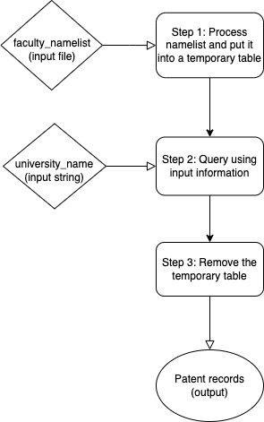

# Patent Mining

## Overview

This module is responsible for finding university patent grant records given the university (grantee) and its faculty name list.

## Setup

1. `Python 3.8.8` and `pip 23.3` were used when running this module.

2. Install necessary modules by running the following command line in the terminal:
```
pip install -r requirements.txt 
```

3. Download `json.zip` in [Google Drive Folder](https://drive.google.com/drive/u/1/folders/1h7U4wiOd3mZg43w8FvMhI_TFpjSQqSy-) and uncompress the zip file in the `database` directory.

4. Create an empty database `patents.db` in the `database` directory. Run `database_setup.py` in the `database` directory to populate the database. It will take about an hour to import all patent records into the database.
```
python database_setup.py
``` 

5. This module contains a basic test suite to verify the functionality of the components. The tests are located in the `tests` directory. To run the testcases, run the following command line in the terminal (root directory):
```
python3 -m unittest tests.test_search_patent
```

6. Optional: This module does not require installing MySQL. However, if you would like to take a better view at the database, install `SQLite` extension by alexcvzz on Visual Studio Code. 
* To open the database, press `Cmd/Ctrl + Shift + P` to open the command palette. Type `sqlite`, and choose `SQLite: Open Database`. The SQLite explorer is available at the bottom left of VSCode workspace.
* To run queries, open the .sql file with a query. Press `Cmd/Ctrl + Shift + P` to open the command palette. Type `sqlite`, and choose `SQLite: Run Query`. Select `database/patents.db`. The `queries` folder contains a few queries that help explore the database.

7. This section gives an overview of the repo's file structure:
```
yujun-yam-patent-mining/
    - database/
        -- database_setup.py
    - faculty_namelist/
        -- jsons/
            --- ucb_historical_cs_faculty.json
            --- uiuc_historical_cs_faculty.json
            --- umich_historical_cs_faculty.json
        -- lists/
            --- ucb_faculty.txt
            --- uiuc_faculty.txt
            --- umich_faculty.txt
    - images/
        -- schema.png
        -- algorithmic_design.png
    - output/
        -- uiuc_final_result.txt
        -- uiuc_result_before_manual_review.txt
    - queries/
        -- q1.sql
        -- q2.sql
        -- q3.sql
    - scripts/
        -- extract_faculty.py
        -- xml_to_json.py
    - src/
        -- main.py
        -- process_namelist.py
        -- search_patents.py
    - test_data/
        -- expected.txt
        -- result.txt
    - tests/
        -- test_search_patent.py
        -- test_set.txt
    - .gitignore
    - README.md
    - requirements.txt
```

* `database/database_setup.py`: creates and populates the database `patents.db`
* `faculty_namelist/lists`: contains extracted CS faculty name list
* `output/`: contains project final result -- patent grants received by UIUC CS faculty
* `scripts/`: contains scripts that assists file conversion, data extraction, and test set generation
* `src/find_all_patents.py`: main function of this module, takes in two command-line arguments -- faculty name list and university name
* `src/process_namelist.py`: processes given faculty name list (e.g. separate first name and last name)
* `src/search_patents.py`: runs queries that find patent records
* `test_data/`: contains test results
* `tests/`: runs test suite to verify the functionality of the components

## Functional Design (Usage)
* Takes in two inputs -- a file of strings each representing a faculty name, and a string of university name -- and outputs the patent grants received by the university
```python
    def find_all_patents(faculty_namelist: file, university_name: str):
        ... 
        return [
            (inventor_first_name, faculty_first_name, faculty_last_name, inventor_city, 
            inventor_state, grantee_name, patent_document_number, document_date, 
            title_of_invention),
            ...
        ]
```

## Demo Video
[Demo Video in Google Drive](https://drive.google.com/file/d/18l12z2bjU0NkBy_43Nh4NmtZ2Th34sw5/view?usp=drive_link)

## Algorithmic Design
* Step 1: The `faculty_namelist` is received as an input file. In this step, the list of names provided is separated into first name and last name, cleaned by removing any middle name and truncating non-alphabetic characters in first names to reduce false negative results. A temporary table is then created and populated by the processed faculty names.

* Step 2: The `university_name` string input is used as a keyword to match with the grantee's name. With the string input and the temporary table created in Step 1, a query is executed to find all patent grants which inventor's last name is equal to the faculty's last name, as well as similar first name and university name. Duplicates are removed by same title of invention and faculty's last name. The query results are sorted by faculty's last name in an ascending order.

* Step 3: The temporary table is removed. The patent records are ready.



## Issues and Future Work
* The fuzzy matching algorithm needs to be improved to reduce the number of false positives.
* Currently, the main function argument needs to take in the university system name to work properly, rather than the specific name of the university (e.g. University of Illinois, not University of Illinois Urbana-Champaign).

## References
* Dataset (Patent Grant Bibliographic (Front Page) Text Data): https://bulkdata.uspto.gov/ 
* Data decoding (2002-2004): https://www.uspto.gov/sites/default/files/products/PatentGrantSGMLv19-Documentation.pdf
* Data decoding (2005-2012): https://bulkdata.uspto.gov/data/patent/grant/redbook/2007/PatentGrantXMLv4.2Documentation.doc